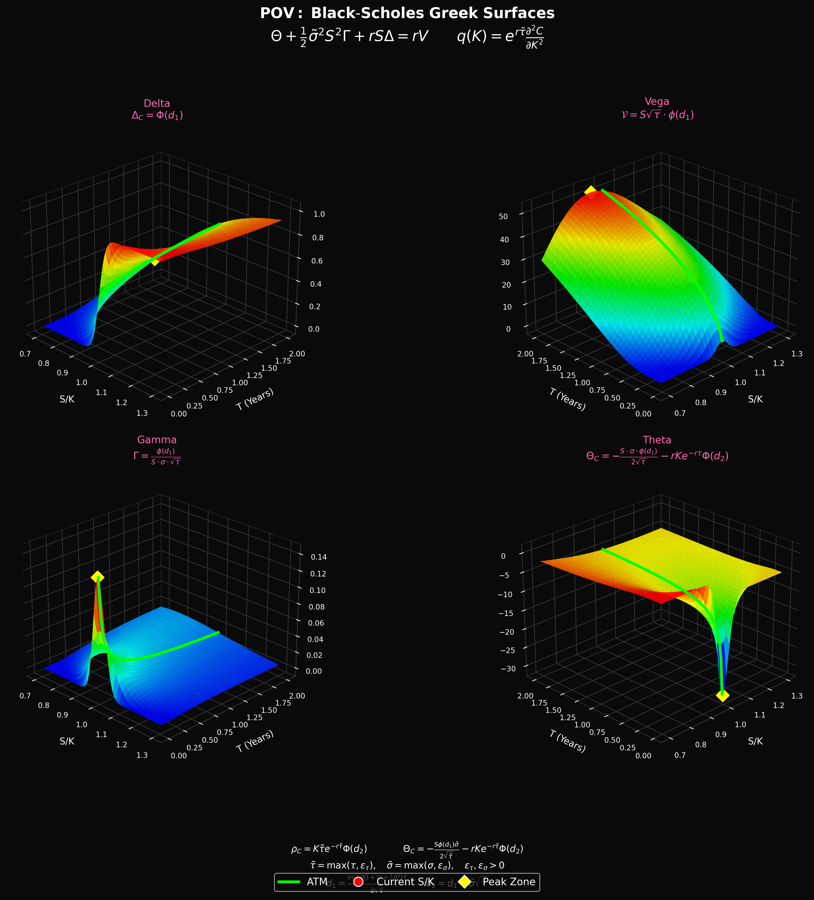

# Black-Scholes Greek Surface Visualization

<p align="center">
  
  
  
</p>

<p align="center">
  <b>Interactive 3D visualizations of Black-Scholes option Greeks as stunning surfaces</b>
</p>

<p align="center">
  
</p>

---

## Overview

This project provides beautiful, interactive 3D surface visualizations of the Black-Scholes option Greeks. It implements the complete Black-Scholes-Merton model with all first and second-order Greeks, offering both interactive Plotly visualizations and publication-quality matplotlib plots.

### Key Features

- **Complete Black-Scholes Implementation**: All Greeks including Delta, Gamma, Theta, Vega, Rho, and second-order Greeks (Vanna, Volga, Charm, Veta, Speed, Zomma, Color)
- **Interactive 3D Surfaces**: Zoom, rotate, and hover for detailed information using Plotly
- **Publication-Quality Plots**: Dark-themed matplotlib visualizations suitable for presentations and papers
- **Animated Visualizations**: See how Greeks change with varying parameters
- **CLI Interface**: Easy command-line tool for generating visualizations
- **Mathematical Rigor**: Verified implementation that satisfies the Black-Scholes PDE

---

## Table of Contents

- [Installation](#installation)
- [Quick Start](#quick-start)
- [Mathematical Background](#mathematical-background)
  - [The Black-Scholes Model](#the-black-scholes-model)
  - [The Greeks](#the-greeks)
  - [The Black-Scholes PDE](#the-black-scholes-pde)
- [Usage](#usage)
  - [Interactive Visualizations](#interactive-visualizations)
  - [Static Plots](#static-plots)
  - [Python API](#python-api)
- [Gallery](#gallery)
- [Understanding the Surfaces](#understanding-the-surfaces)
- [Contributing](#contributing)
- [License](#license)

---

## Installation

### From Source

```bash
# Clone the repository
git clone https://github.com/yourusername/Black-Scholes-Greek-Surface.git
cd Black-Scholes-Greek-Surface

# Create virtual environment (recommended)
python -m venv venv
source venv/bin/activate  # On Windows: venv\Scripts\activate

# Install dependencies
pip install -r requirements.txt

# Or install as package
pip install -e .
```

### Requirements

- Python 3.8+
- NumPy
- SciPy
- Matplotlib
- Plotly

---

## Quick Start

```bash
# Calculate Greeks for a specific position
python main.py --calculate --spot 105 --strike 100 --time 0.5 --sigma 0.2

# Interactive Delta surface
python main.py --interactive --greek delta --type call

# All Greeks in one interactive plot
python main.py --interactive --all-greeks --spot 100 --time 0.5

# Static publication-quality poster
python main.py --poster --save greeks_poster.png

# Animation of Delta vs Volatility
python main.py --animate --greek delta --vary sigma
```

---

## Mathematical Background

### The Black-Scholes Model

The Black-Scholes-Merton model provides a theoretical estimate for the price of European-style options. The model assumes:

- The underlying asset follows geometric Brownian motion
- No dividends are paid during the option's life (or continuous dividend yield q)
- Markets are efficient (no arbitrage opportunities)
- The risk-free rate and volatility are constant
- Options can only be exercised at expiration (European style)

#### Option Pricing Formulas

**Call Option:**
$$C = Se^{-q\tau}\Phi(d_1) - Ke^{-r\tau}\Phi(d_2)$$

**Put Option:**
$$P = Ke^{-r\tau}\Phi(-d_2) - Se^{-q\tau}\Phi(-d_1)$$

Where:
$$d_1 = \frac{\ln(S/K) + (r - q + \frac{1}{2}\sigma^2)\tau}{\sigma\sqrt{\tau}}$$

$$d_2 = d_1 - \sigma\sqrt{\tau}$$

**Variables:**
| Symbol | Description |
|--------|-------------|
| $S$ | Current price of the underlying asset |
| $K$ | Strike price |
| $\tau$ | Time to expiration (in years) |
| $r$ | Risk-free interest rate (annualized) |
| $\sigma$ | Volatility of the underlying (annualized) |
| $q$ | Continuous dividend yield |
| $\Phi(\cdot)$ | Standard normal CDF |
| $\phi(\cdot)$ | Standard normal PDF |

---

### The Greeks

The Greeks measure the sensitivity of the option price to various parameters. They are essential for risk management and hedging strategies.

#### First-Order Greeks

##### Delta (Δ) - Price Sensitivity

Delta measures how much the option price changes when the underlying price moves by $1.

$$\Delta_{call} = e^{-q\tau}\Phi(d_1)$$
$$\Delta_{put} = e^{-q\tau}[\Phi(d_1) - 1]$$

**Interpretation:**
- Call Delta ranges from 0 to 1
- Put Delta ranges from -1 to 0
- ATM options have Delta ≈ ±0.5
- Delta can be interpreted as the probability of expiring ITM

##### Gamma (Γ) - Delta Sensitivity

Gamma measures the rate of change of Delta with respect to the underlying price.

$$\Gamma = \frac{e^{-q\tau}\phi(d_1)}{S\sigma\sqrt{\tau}}$$

**Interpretation:**
- Gamma is always positive for long options
- Highest for ATM options near expiration
- Represents convexity in the option's payoff

##### Theta (Θ) - Time Decay

Theta measures the rate of decline in option value due to the passage of time.

$$\Theta_{call} = -\frac{S\sigma e^{-q\tau}\phi(d_1)}{2\sqrt{\tau}} - rKe^{-r\tau}\Phi(d_2) + qSe^{-q\tau}\Phi(d_1)$$

$$\Theta_{put} = -\frac{S\sigma e^{-q\tau}\phi(d_1)}{2\sqrt{\tau}} + rKe^{-r\tau}\Phi(-d_2) - qSe^{-q\tau}\Phi(-d_1)$$

**Interpretation:**
- Usually negative for long options (time works against you)
- Accelerates as expiration approaches
- Highest magnitude for ATM options

##### Vega (ν) - Volatility Sensitivity

Vega measures the sensitivity of the option price to changes in implied volatility.

$$\mathcal{V} = Se^{-q\tau}\sqrt{\tau}\phi(d_1)$$

**Interpretation:**
- Always positive for long options
- Highest for ATM options with longer time to expiration
- Critical for volatility trading strategies

##### Rho (ρ) - Interest Rate Sensitivity

Rho measures the sensitivity of the option price to changes in the risk-free rate.

$$\rho_{call} = K\tau e^{-r\tau}\Phi(d_2)$$
$$\rho_{put} = -K\tau e^{-r\tau}\Phi(-d_2)$$

**Interpretation:**
- Positive for calls (higher rates increase call values)
- Negative for puts (higher rates decrease put values)
- More significant for longer-dated options

#### Second-Order Greeks

| Greek | Formula | Description |
|-------|---------|-------------|
| **Vanna** | $-e^{-q\tau}\phi(d_1)\frac{d_2}{\sigma}$ | ∂Δ/∂σ = ∂ν/∂S |
| **Volga** | $\mathcal{V}\frac{d_1 d_2}{\sigma}$ | ∂²V/∂σ² (Vomma) |
| **Charm** | $qe^{-q\tau}\Phi(\pm d_1) - e^{-q\tau}\phi(d_1)\frac{2(r-q)\tau - d_2\sigma\sqrt{\tau}}{2\tau\sigma\sqrt{\tau}}$ | ∂Δ/∂τ (Delta decay) |
| **Speed** | $-\frac{\Gamma}{S}(1 + \frac{d_1}{\sigma\sqrt{\tau}})$ | ∂Γ/∂S |
| **Zomma** | $\Gamma\frac{d_1 d_2 - 1}{\sigma}$ | ∂Γ/∂σ |
| **Color** | $-\frac{e^{-q\tau}\phi(d_1)}{2S\tau\sigma\sqrt{\tau}}(2q\tau + 1 + d_1\frac{2(r-q)\tau - d_2\sigma\sqrt{\tau}}{2\tau\sigma\sqrt{\tau}})$ | ∂Γ/∂τ |

---

### The Black-Scholes PDE

The Black-Scholes partial differential equation describes the evolution of option prices:

$$\frac{\partial V}{\partial t} + \frac{1}{2}\sigma^2 S^2\frac{\partial^2 V}{\partial S^2} + rS\frac{\partial V}{\partial S} - rV = 0$$

In terms of Greeks:

$$\boxed{\Theta + \frac{1}{2}\sigma^2 S^2\Gamma + rS\Delta = rV}$$

This fundamental relationship connects all the major Greeks and forms the basis for delta hedging and risk-neutral pricing.

---

## Usage

### Interactive Visualizations

Create stunning interactive 3D surfaces that can be rotated, zoomed, and explored:

```python
from src.visualizations import GreekSurfaceVisualizer

# Initialize with option parameters
viz = GreekSurfaceVisualizer(K=100, r=0.05, sigma=0.2)

# Create Delta surface
fig = viz.plot_greek_surface(
    greek='delta',
    option_type='call',
    current_S=100,      # Mark current spot on surface
    current_T=0.5,      # Mark current time on surface
    show_atm_line=True, # Show ATM (S/K=1) line
    show_peak=True      # Show peak zone marker
)
fig.show()

# Create all Greeks in one plot
fig_all = viz.plot_all_greeks(option_type='call', current_S=100, current_T=0.5)
fig_all.show()

# Save as interactive HTML
viz.save_html(fig, 'delta_surface.html')
```

### Static Plots

Generate publication-quality matplotlib visualizations:

```python
from src.static_plots import StaticGreekPlotter
import matplotlib.pyplot as plt

plotter = StaticGreekPlotter(K=100, r=0.05, sigma=0.2)

# Single Greek surface
fig = plotter.plot_greek_surface(
    greek='gamma',
    option_type='call',
    current_S=100,
    current_T=0.5,
    colormap='rainbow_dark'
)
plotter.save_figure(fig, 'gamma_surface.png', dpi=300)

# All Greeks poster
fig = plotter.create_poster(
    option_type='call',
    current_S=100,
    current_T=0.5,
    save_path='greeks_poster.png'
)
plt.close()
```

### Python API

Direct calculation of Greeks:

```python
from src.black_scholes import BlackScholes, verify_bs_pde

# Create Black-Scholes instance
bs = BlackScholes(
    S=105,      # Spot price
    K=100,      # Strike
    T=0.5,      # Time to expiration (years)
    r=0.05,     # Risk-free rate
    sigma=0.2,  # Volatility
    q=0.0       # Dividend yield
)

# Option prices
call_price = bs.call_price()  # $8.59
put_price = bs.put_price()    # $1.15

# Individual Greeks
delta = bs.delta('call')      # 0.6736
gamma = bs.gamma()            # 0.0257
theta = bs.theta('call')      # -6.4147 (per year)
vega = bs.vega()              # 27.12
rho = bs.rho('call')          # 27.64

# All Greeks at once
greeks = bs.all_greeks('call')
print(f"Delta: {greeks.delta:.4f}")
print(f"Gamma: {greeks.gamma:.4f}")
print(f"Vanna: {greeks.vanna:.4f}")

# Verify BS PDE holds
lhs, rhs = verify_bs_pde(105, 100, 0.5, 0.05, 0.2)
print(f"PDE verification: LHS={lhs:.6f}, RHS={rhs:.6f}")
# Should be equal (difference < 1e-10)

# Calculate implied volatility
market_price = 8.50
iv = bs.implied_volatility(market_price, 'call')
print(f"Implied Volatility: {iv:.2%}")
```

### CLI Commands

```bash
# Calculate Greeks for a position
python main.py --calculate --spot 105 --strike 100 --time 0.5 --sigma 0.2 --rate 0.05

# Interactive Delta surface for calls
python main.py --interactive --greek delta --type call

# All Greeks interactive (with current position marked)
python main.py --interactive --all-greeks --spot 100 --time 0.5

# Static Gamma surface for puts
python main.py --static --greek gamma --type put --save gamma_put.png

# Publication poster
python main.py --poster --save greeks_poster.png --dpi 300

# Animation: Delta surface varying with volatility
python main.py --animate --greek delta --vary sigma --save delta_vol_animation.html

# Animation: Gamma surface varying with strike
python main.py --animate --greek gamma --vary K
```

---

## Gallery

### Delta Surface
The Delta surface shows how option sensitivity to price changes varies with moneyness (S/K) and time to expiration. Notice how:
- Delta approaches 1 for deep ITM calls
- Delta approaches 0 for deep OTM calls
- ATM options have Delta ≈ 0.5
- Delta becomes more binary as expiration approaches

### Gamma Surface
The Gamma surface reveals where delta hedging is most challenging:
- Peak Gamma occurs ATM
- Gamma spike intensifies near expiration
- OTM and ITM options have low Gamma

### Theta Surface
The Theta (time decay) surface shows:
- Time decay accelerates near expiration
- ATM options decay fastest
- Deep ITM/OTM options have minimal theta

### Vega Surface
The Vega surface illustrates volatility sensitivity:
- Longest-dated ATM options have highest Vega
- Vega decreases as expiration approaches
- OTM/ITM options have lower Vega

---

## Understanding the Surfaces

### Reading the Visualizations

Each 3D surface plot shows a Greek value across two dimensions:
- **X-axis (S/K)**: Moneyness - the ratio of spot price to strike
  - S/K < 1: Out-of-the-money (OTM) for calls, ITM for puts
  - S/K = 1: At-the-money (ATM)
  - S/K > 1: In-the-money (ITM) for calls, OTM for puts
- **Y-axis (T)**: Time to expiration in years
- **Z-axis**: The Greek value

### Visual Elements

- **Green Line (ATM)**: Shows Greek values along S/K = 1
- **Red Marker**: Your current position
- **Yellow Diamond**: Peak zone (where the Greek is most extreme)
- **Color Gradient**: Blue/Purple (low values) → Yellow/Red (high values)

### Trading Insights

| Scenario | Greek Focus | Action |
|----------|------------|--------|
| Hedging stock position | Delta | Match deltas to neutralize |
| Near expiration | Gamma, Theta | Monitor for rapid changes |
| Volatility plays | Vega | Long options for vol increase |
| Income strategies | Theta | Collect time decay |
| Rate sensitivity | Rho | Relevant for long-dated LEAPS |

---

## Project Structure

```
Black-Scholes-Greek-Surface/
├── src/
│   ├── __init__.py           # Package initialization
│   ├── black_scholes.py      # Core BS calculations
│   ├── visualizations.py     # Interactive Plotly visualizations
│   └── static_plots.py       # Static matplotlib plots
├── main.py                   # CLI application
├── requirements.txt          # Python dependencies
├── setup.py                  # Package setup
├── pyproject.toml            # Modern Python packaging
└── README.md                 # This file
```

---

## Mathematical Verification

The implementation includes verification that the Black-Scholes PDE is satisfied:

```python
from src.black_scholes import verify_bs_pde

# Verify: Θ + ½σ²S²Γ + rSΔ = rV
lhs, rhs = verify_bs_pde(S=100, K=100, T=1.0, r=0.05, sigma=0.2)
print(f"LHS: {lhs:.10f}")
print(f"RHS: {rhs:.10f}")
print(f"Difference: {abs(lhs-rhs):.2e}")
# Difference should be < 1e-10
```

---

## Contributing

Contributions are welcome! Please feel free to submit a Pull Request. For major changes, please open an issue first to discuss what you would like to change.

### Development Setup

```bash
# Install development dependencies
pip install -e ".[dev]"

# Run tests
pytest

# Format code
black src/ main.py
isort src/ main.py

# Type checking
mypy src/
```

---

## References

1. Black, F., & Scholes, M. (1973). The Pricing of Options and Corporate Liabilities. *Journal of Political Economy*, 81(3), 637-654.

2. Merton, R. C. (1973). Theory of Rational Option Pricing. *Bell Journal of Economics and Management Science*, 4(1), 141-183.

3. Hull, J. C. (2018). *Options, Futures, and Other Derivatives* (10th ed.). Pearson.

4. Wilmott, P. (2006). *Paul Wilmott on Quantitative Finance* (2nd ed.). Wiley.

---

## License

This project is licensed under the MIT License - see the [LICENSE](LICENSE) file for details.

---

## Acknowledgments

- Inspired by the elegant mathematics of the Black-Scholes model
- Built with love for the quant finance community
- Special thanks to the open-source visualization libraries (Plotly, Matplotlib)

---

<p align="center">
  <b>Θ + ½σ²S²Γ + rSΔ = rV</b>
</p>

<p align="center">
  Made with ❤️ for quantitative finance enthusiasts
</p>
